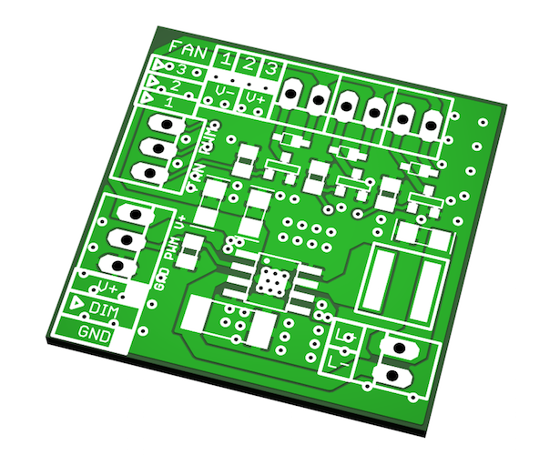
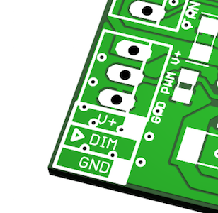
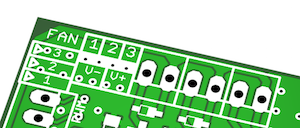
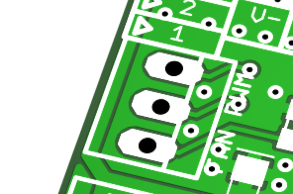

# Laser Driver
Small compact, constant current source for driving LEDs and lasers up to 4A with PWM capabilities and integrated support to drive 3 loads such as fans.

## Board specification
### Electrical characteristics
   **V(in) range:**  4V..18V, *observe input caps ratings*
   **Max main load current:** 3.3A *observe inductor ratings*
   **Max aux load currents:** 500mA *depends on transistor selection*
   **Dim threshold voltage:** 1.2V
   **Duty cycle range:** 0%..100%
   **Soft start duration:** 1.2ms
   **Dim frequency range:** 400Hz..4KHz

### Mechanical
   **Board dimensions:** 32mm x 32mm
   **Supply and main load dimming:** 1 x 3 pin, 2.54mm connector
   **Main load connector:** 1 x 2 pin, 2.54mm connector
   **Aux. load dimm connector:** 1 x 3 pin, 2.54mm connector
   **Aux. load connector:** 3 x 2 pin, 2.54mm connector
   **PCB fabrication:** Pattern class 6, drills clase C. Any cheap PCB manufacturer should be more than capable of making your boards. *Do not shrink track widths.*

*Observe connector current ratings for your application.*

### Measured performance
   **Performance:** Measure performance 83% @ 12V, 1A load. Tested with a 3W LED.

## Operation and setup

Connect power supply to the supply and main load dimming connector observing the polarity
(V+, DIM, V-) within the board's tolerance and ensure that your supply is capable of sourcing
the current required by your load.

Connect the load (LED or laser driver) observing the polarity of your device.

If you use auxiliary loads connect them to the auxiliary load connectors and observe their polarity.
The board has built in freewheel diodes, you should be good to go with any type of load provided you don't
exceed switching ratings.

Each auxiliary load channel is controlled with a control signal from the aux load connector. By default
loads are inactive. A voltage level of 5V (depending on your FET selection) will activate each channel.

### Soft start
The board is configured to do a soft start. Apply a 1.2ms (minimum) pulse to the dimm pin before
starting the PWM operation.

## Disclaimer
The board has only been tested to switch a 3W LED driven at 1A. It should be more than capable of reaching
it's full specifications provided that you don't exceed the current ratings of the components you mount.

## License
The board is released under the CERN OHL v1.2 but if you like it and use it you can buy me some beer.
If you use it and/or do any derivative work from it, be nice and give attribution to the source.
